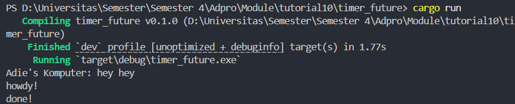
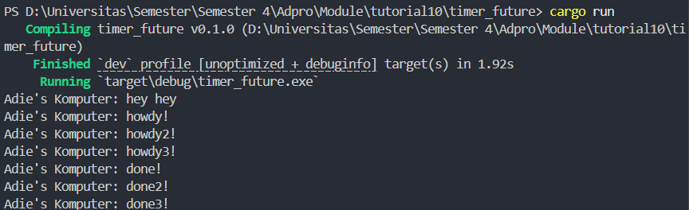
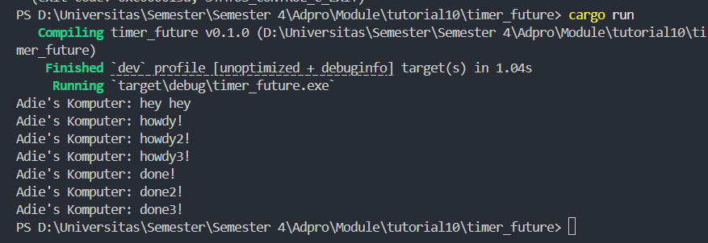

- Program tersebut menjalankan sistem eksekusi asynchronous sederhana menggunakan future kustom bernama `TimerFuture`, yang menunda eksekusi selama dua detik tanpa memblokir thread utama. Saat program dijalankan, ia langsung mencetak “Adie’s Komputer: hey hey”, lalu mengeksekusi task async yang mencetak “howdy!”, kemudian menunggu dua detik secara non-blocking melalui thread terpisah. Setelah waktu habis, task dibangunkan kembali oleh `Waker`, dan mencetak “done!”. Ini menunjukkan bahwa sistem executor, spawner, dan future berjalan dengan benar sesuai mekanisme asynchronous yang diharapkan.

- Dengan drop spawner:

- Tanpa drop spawner:

Penjelasan:
- Pada implementasi async runtime ini, jika baris `drop(spawner)` dihapus atau dikomentari, program akan terus berjalan tanpa henti karena saluran komunikasi antara spawner dan executor tetap terbuka. Akibatnya, `executor.run()` yang menggunakan loop `while let Ok(task) = self.ready_queue.recv()` akan terus menunggu task baru selama channel belum ditutup. Selama spawner masih aktif, executor tidak mengetahui bahwa semua task telah selesai, sehingga terus siaga menerima task tambahan. Sebaliknya, saat `drop(spawner)` dijalankan, channel ditutup secara eksplisit, `recv()` akan menghasilkan error, dan loop berhenti, memungkinkan program berakhir dengan normal. Hal ini menunjukkan pentingnya mekanisme penghentian (shutdown) yang tepat dalam runtime asynchronous agar eksekusi program dapat berhenti dengan benar setelah seluruh task selesai diproses.

